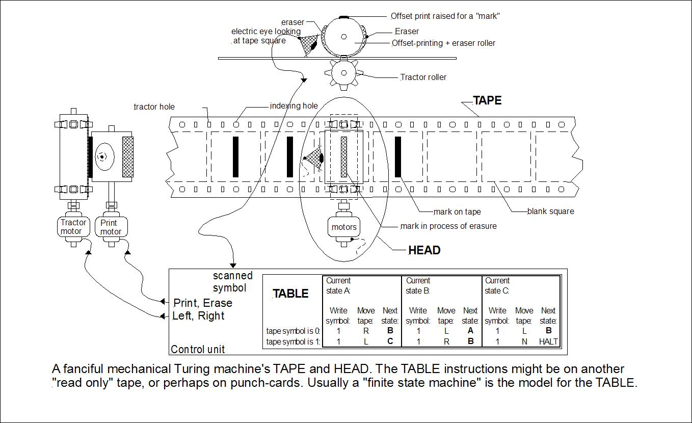

class: middle, center, inverse

# Be Functional

### An introduction on metaprogramming and lambda

.footnote[David Wang (From CA team)]

---
# Agenda

1. The Paradigms of Programming
2. Church and Turning
3. LISP in 5 Minutes
4. No Variables? No side effects?
5. Limitation of substitution model
6. The Functional Way
7. Lambda
8. Metaprogramming
    - Java Generics, Reflection
    - C++ Templates, RTTI
    - Ruby Metaprogramming
    - LISP Macro
9. Book Recommondation

---
class: middle, center, inverse

# Paradigms of Programming

---
class: middle, large-list

- Imperative
    - Procedural
    - Object Oriented
- Declarative
    - Functional
    - Logical
    - DSL (Regex, SQL, Configuration etc)

---
count: false
class: middle, large-list

- Imperative
    - Procedural
    - Object Oriented
- Declarative
    -  **Functional**
    - Logical
    - DSL (Regex, SQL, Configuration etc)

---
# Alan Turing
.width40[.center[]]

---
# Turing Machine
.width90[.center[]]

---
# Alonzo Church
.width30[.center[]]

Church was an American mathematician, who is best known for the lambda calculus, Church–Turing thesis, proving the undecidability of the Entscheidungsproblem, Frege–Church ontology, and the Church–Rosser theorem.

---
class: middle, center, inverse

# LISP in 5 Minutes :-)
